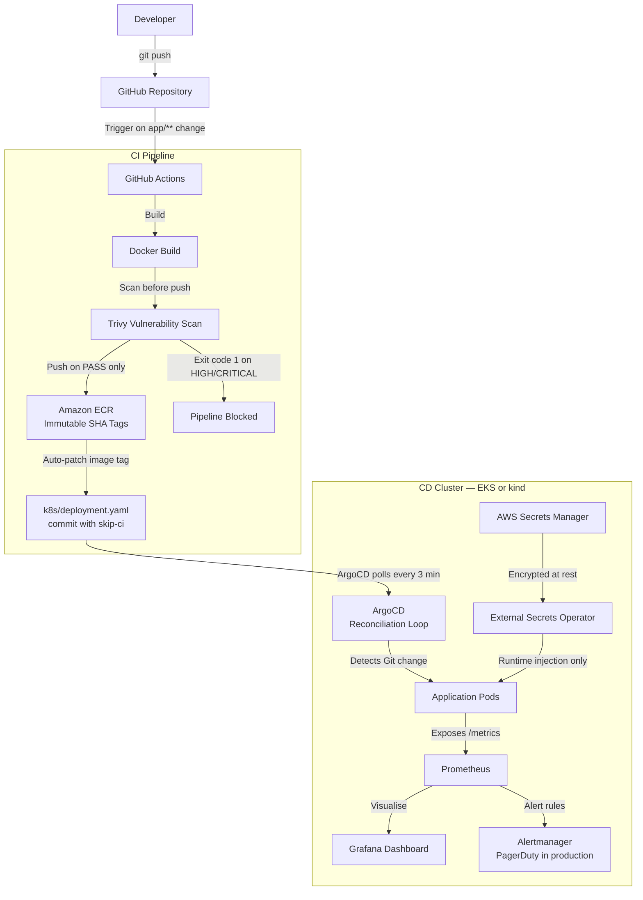
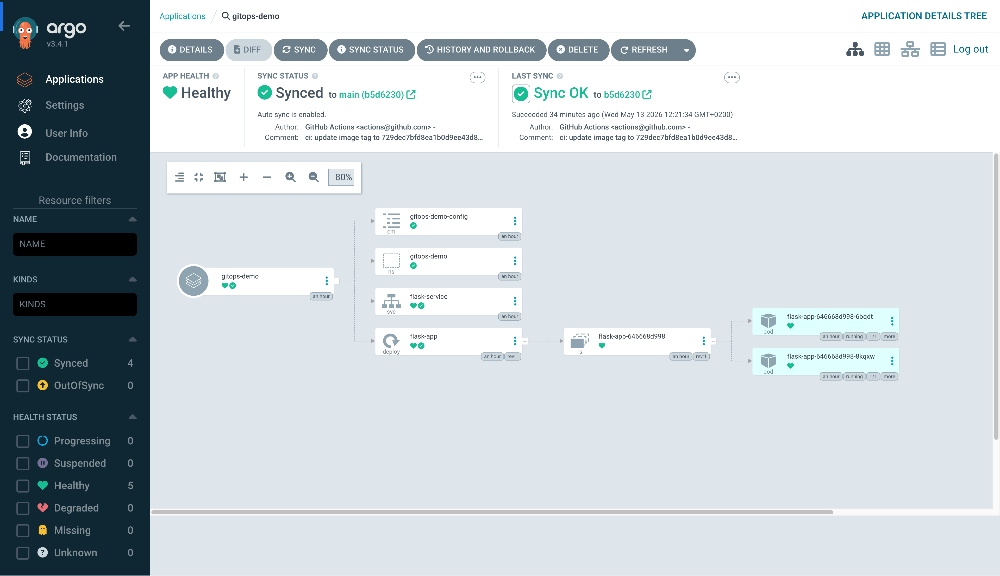
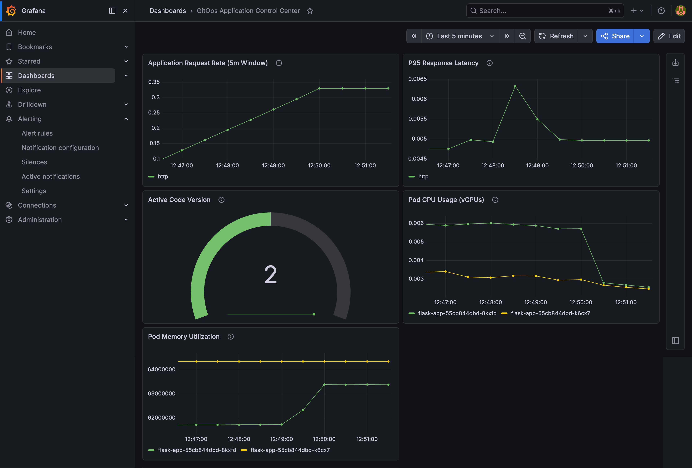
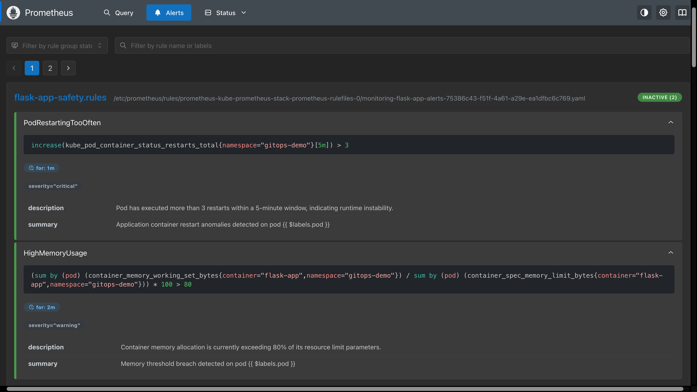
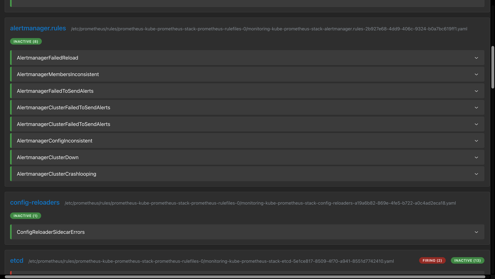
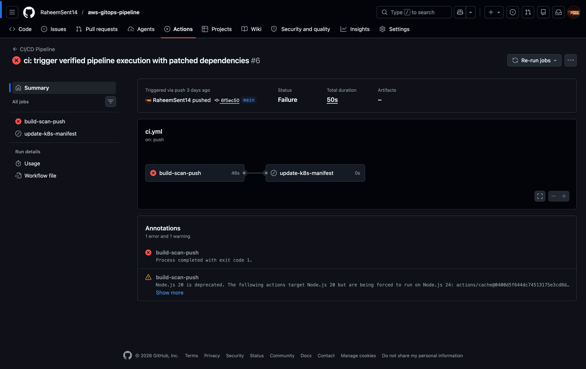
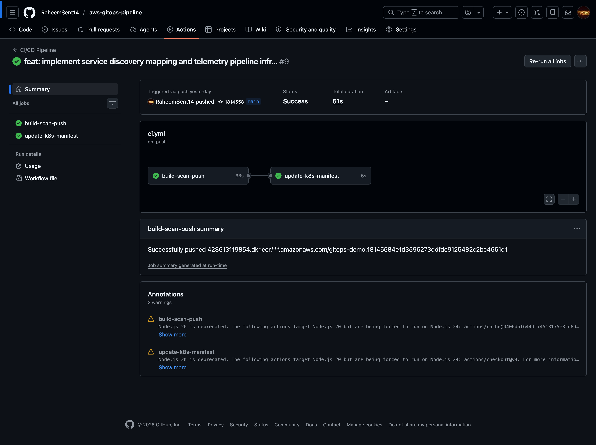
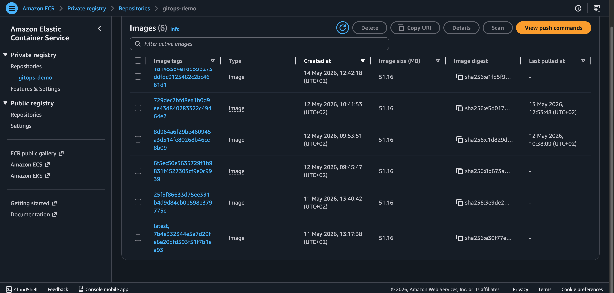

# AWS GitOps Pipeline: Automated EKS Delivery and Security
**Architected by Raheem Senteza**


---

## 1. The Business Case

When a software team grows from 5 to 50 engineers, manual deployments become the single biggest source of outages. A developer running `kubectl apply` from their laptop introduces configuration drift — the live cluster quietly diverges from what anyone intended, and nobody knows until something breaks at 2am. For a company running a SaaS product, even 30 minutes of degraded service can cost thousands in lost revenue and erode customer trust permanently.

This project implements a declarative GitOps architecture where Git is the only authority over what runs in production. Every change — from application code to the VPC routing table — is a version-controlled event with a full audit trail and a one-command rollback path. The system does not wait for a human to notice drift. It detects and corrects it automatically, within seconds.

By treating infrastructure as code, this pipeline eliminates the gap between "what we deployed" and "what is running." Security vulnerabilities are caught before they ever reach the registry. Secrets never appear in a config file. And when something goes wrong, the debugging story starts with a Git commit hash, not a guessing game.

---

## 2. Architecture in Plain English

Think of this system as a self-correcting construction site. There is a master blueprint locked in a vault (GitHub). Every time an engineer submits a change to the blueprint, a safety inspector (GitHub Actions and Trivy) checks it for structural defects and security violations before approving it. Once approved, a certified courier (ArgoCD) delivers the updated blueprint to the site and ensures every worker follows it exactly.

If a rogue contractor sneaks onto the site at midnight and moves a wall, the site manager (ArgoCD's reconciliation loop) checks the vault blueprint first thing in the morning — actually, every three minutes — and moves the wall back. The vault always wins.

---

## 3. Architecture Diagram



---

## 4. Folder Structure

```text
aws-gitops-pipeline/
├── .github/
│   └── workflows/
│       └── ci.yml                  # CI pipeline: build, scan, push, patch manifest
├── app/
│   ├── app.py                      # Stateless Flask app with Prometheus instrumentation
│   ├── Dockerfile                  # Non-root, slim, layer-cached container build
│   └── requirements.txt            # Pinned dependencies — no floating versions
├── k8s/
│   ├── namespace.yaml              # Logical isolation boundary for the workload
│   ├── configmap.yaml              # Non-sensitive runtime configuration
│   ├── deployment.yaml             # Pod spec with resource limits and health probes
│   ├── service.yaml                # ClusterIP internal routing with named ports
│   ├── argocd/
│   │   └── application.yaml        # ArgoCD Application CR — the GitOps contract
│   ├── monitoring/
│   │   ├── servicemonitor.yaml     # Tells Prometheus which pods to scrape
│   │   └── alert-rules.yaml        # PrometheusRules for restart loops and memory pressure
│   └── secrets/
│       ├── secret-store.yaml       # ClusterSecretStore — points to AWS Secrets Manager
│       └── external-secret.yaml    # ExternalSecret — pulls and injects at runtime
├── terraform/
│   ├── ecr/                        # ECR repository, IMMUTABLE tags, lifecycle policy
│   ├── eks/                        # VPC, subnets, EKS cluster, managed node group
│   └── iam/                        # Least-privilege IAM for CI user and ESO operator
└── kind-config.yaml                # Local multi-node cluster (control-plane + worker)
```

| Path | Why it exists |
| :--- | :--- |
| `.github/workflows/ci.yml` | Triggered on `app/**` changes only — k8s manifest changes do not re-run CI |
| `app/app.py` | Stateless by design; no database dependency means horizontal scaling is trivial |
| `app/Dockerfile` | `python:3.11-slim` chosen over Alpine to avoid C-binding compilation failures |
| `k8s/argocd/application.yaml` | The single manifest that connects Git to the live cluster — ArgoCD's source of truth |
| `k8s/monitoring/servicemonitor.yaml` | Required for cross-namespace Prometheus scraping — without it, the target is invisible |
| `k8s/secrets/external-secret.yaml` | Refreshes every hour — secret rotation in Secrets Manager propagates automatically |
| `terraform/ecr/` | Separate module from EKS so ECR can stay alive without a running cluster |
| `terraform/eks/` | Apply before showcasing, destroy immediately after — Terraform makes this one command |
| `kind-config.yaml` | Used for all local development — zero cost, identical manifests to production |

---

## 5. Every Engineering Decision Documented

- **What I chose:** SHA tags for container images — never `latest`
  - **Why:** `latest` is a mutable pointer. If a bad image is tagged `latest`, you cannot roll back — you have no idea what `latest` was yesterday. Git SHA tags are immutable fingerprints. Every running pod can be traced to an exact commit.
  - **What I rejected:** `latest` and semantic version tags like `v1.0.0` (semantic versions can be re-pushed; SHAs cannot)
  - **At larger scale:** Add image signing with AWS Signer or Cosign to cryptographically verify that the image in ECR was produced by your CI system, not a compromised developer machine.

- **What I chose:** ArgoCD for GitOps delivery
  - **Why:** ArgoCD runs an in-cluster reconciliation loop, polling Git every 3 minutes. Because it pulls from inside the cluster, there is no inbound firewall rule required and no external system holding cluster admin credentials. The visual UI also makes deployment events and drift immediately visible to the whole team.
  - **What I rejected:** Flux (also excellent, but ArgoCD's UI and `Application` CRD are easier to demonstrate and explain in a team context), manual `kubectl apply` in CI (requires storing cluster credentials in GitHub Secrets — a larger attack surface).
  - **At larger scale:** Add ApplicationSets to manage deployments across multiple clusters from a single ArgoCD instance. Use SSO integration (Dex + OIDC) to gate access to the UI.

- **What I chose:** Trivy blocking on HIGH and CRITICAL
  - **Why:** The scanner caught a real vulnerability during development — `gunicorn 21.2.0` was vulnerable to HTTP Request Smuggling (CVE-2024-1135). The pipeline blocked the push. That is the system working correctly. Blocking only on CRITICAL misses a large class of exploitable vulnerabilities that are rated HIGH but actively used in the wild.
  - **What I rejected:** Scanning after push (too late — the vulnerable image is already in the registry), scanning only on CRITICAL (misses gunicorn-class vulnerabilities).
  - **At larger scale:** Add a Software Bill of Materials (SBOM) export step using `trivy sbom` and store it alongside the image in ECR. Required for SOC 2 and FedRAMP compliance.

- **What I chose:** External Secrets Operator + AWS Secrets Manager
  - **Why:** Kubernetes Secrets are base64-encoded, not encrypted. Anyone with cluster read access can decode them trivially. Secrets Manager encrypts at rest with KMS, logs every access in CloudTrail, and supports automatic rotation. ESO bridges the two — pods get standard Kubernetes Secrets at runtime without any plaintext ever touching Git.
  - **What I rejected:** Kubernetes Secrets populated by CI (credentials live in GitHub Secrets and state files), HashiCorp Vault (more powerful but significantly more operational overhead for a single-cluster setup).
  - **At larger scale:** On EKS, replace the static IAM credentials used here with IRSA (IAM Roles for Service Accounts). The ESO pod assumes an IAM role via a Kubernetes service account annotation — no long-lived credentials anywhere.

- **What I chose:** Single NAT Gateway
  - **Why:** A NAT Gateway per Availability Zone costs ~$0.045/hr each. For a portfolio project with two AZs, that doubles the networking bill for a failure mode (AZ outage) that is vanishingly rare and acceptable in a dev environment.
  - **What I rejected:** One NAT Gateway per AZ (production-correct but unnecessary here).
  - **At larger scale:** Restore one NAT Gateway per AZ for true high availability. If `us-east-1a` loses internet routing, private subnets in `us-east-1b` should not be affected.

- **What I chose:** `python:3.11-slim` base image
  - **Why:** Alpine uses musl libc instead of glibc. Many Python packages with C extensions fail to compile on Alpine, or require installing a full build toolchain which defeats the purpose of using a minimal image. Slim gives you 90% of Alpine's size reduction with none of the compatibility risk.
  - **What I rejected:** `python:3.11-alpine` (C-binding failures with certain packages), `python:3.11` (full image — unnecessary 400MB+ overhead).
  - **At larger scale:** Use multi-stage builds to compile any C extensions in a build stage and copy only the resulting binaries into the slim runtime stage, reducing the final image further.

- **What I chose:** ServiceMonitor for Prometheus scraping
  - **Why:** Static scrape configs require editing Prometheus configuration files directly. ServiceMonitors are Kubernetes Custom Resources — they live in version control alongside the manifests they describe, they are namespace-aware, and they work automatically with the Prometheus Operator's discovery system.
  - **Debugging note:** ServiceMonitors require the `release` label on the monitor to match the Helm release name of `kube-prometheus-stack`. Missing this label causes the "No Data" bug silently — Prometheus shows no error, just no targets.
  - **At larger scale:** Use PodMonitors for workloads that cannot be fronted by a Service, and add metric relabeling rules to drop high-cardinality labels before they reach the TSDB.

---

## 6. Security Posture

**Important caveat on local secrets:** The `ClusterSecretStore` in `k8s/secrets/` uses static IAM credentials stored in a Kubernetes Secret for local kind development. This is acceptable locally because the cluster is not internet-accessible. In production EKS, this is replaced with IRSA — the ESO pod assumes an IAM role via a service account annotation, and no long-lived credentials exist anywhere in the cluster. The IRSA configuration is documented in comments inside `secret-store.yaml`.

**Security checklist:**

- [x] Non-root container execution — `appuser` system account, no privilege escalation path
- [x] Immutable ECR image tags — pushed artifacts cannot be overwritten or silently replaced
- [x] Trivy blocks HIGH and CRITICAL CVEs — vulnerable images never reach the registry
- [x] Separate IAM roles — CI user, EKS cluster role, and ESO operator each have their own scoped policy
- [x] External Secrets Operator — zero plaintext secrets in Git or ConfigMaps
- [x] TruffleHog clean — full Git history scanned, `verified_secrets: 0`
- [x] `.gitignore` enforced:

```gitignore
.DS_Store
*.pem
*.key
kubeconfig
.terraform/
*.tfvars
terraform.tfstate
terraform.tfstate.backup
*.tfplan
# Note: .terraform.lock.hcl is intentionally committed
# It pins exact provider binary versions across all environments
```

---

## 7. How to Reproduce This

### Prerequisites

| Tool | Purpose | Install |
| :--- | :--- | :--- |
| AWS CLI | Authenticate with AWS | `brew install awscli` or [docs.aws.amazon.com](https://docs.aws.amazon.com/cli/latest/userguide/install-cliv2.html) |
| Terraform >= 1.5 | Provision cloud infrastructure | `brew install terraform` |
| kubectl | Manage Kubernetes cluster | `brew install kubectl` |
| Helm | Deploy ArgoCD and monitoring stack | `brew install helm` |
| kind | Local Kubernetes for development | `brew install kind` |
| Docker | Build and run containers | [docker.com](https://www.docker.com/products/docker-desktop) |

### Local development (free — no AWS charges)

```bash
git clone https://github.com/RaheemSent14/aws-gitops-pipeline
cd aws-gitops-pipeline

# Start the local cluster
kind create cluster --config kind-config.yaml

# Deploy the application stack
kubectl apply -f k8s/namespace.yaml
kubectl apply -f k8s/configmap.yaml
kubectl apply -f k8s/deployment.yaml
kubectl apply -f k8s/service.yaml

# Verify pods are healthy
kubectl get pods -n gitops-demo -w
```

### Provision cloud infrastructure (~$0.15/hr while running)

```bash
# Step 1 — ECR (stays running — minimal cost)
cd terraform/ecr
terraform init && terraform apply
# Note the repository_url output — add it to GitHub Actions secrets

# Step 2 — EKS cluster and networking
cd ../eks
terraform init && terraform apply
aws eks update-kubeconfig --name gitops-cloud-cluster --region us-east-1

# Verify nodes are ready
kubectl get nodes
```

### Install GitOps and observability stack

```bash
# ArgoCD
helm repo add argo https://argoproj.github.io/argo-helm && helm repo update
helm install argocd argo/argo-cd --namespace argocd --create-namespace
kubectl apply -f k8s/argocd/application.yaml

# Prometheus + Grafana
helm repo add prometheus-community https://prometheus-community.github.io/helm-charts
helm install kube-prometheus-stack prometheus-community/kube-prometheus-stack \
  --namespace monitoring --create-namespace \
  --set prometheus.prometheusSpec.serviceMonitorSelectorNilUsesHelmValues=false

kubectl apply -f k8s/monitoring/
```

### Access the dashboards

```bash
# ArgoCD UI
kubectl port-forward svc/argocd-server -n argocd 8080:443
# URL: https://localhost:8080 | User: admin
# Password: kubectl -n argocd get secret argocd-initial-admin-secret \
#   -o jsonpath="{.data.password}" | base64 -d

# Grafana
kubectl port-forward svc/kube-prometheus-stack-grafana -n monitoring 3000:80
# URL: http://localhost:3000 | User: admin | Password: admin
```

### ⚠️ Destroy resources when done

```bash
cd terraform/eks && terraform destroy
# ECR can stay — monthly cost is cents for stored images
# Estimated total for a 2-hour EKS session: ~$0.40
```

---

## 8. Real-World Debugging Evidence

These are the problems that actually happened during the build. They are better interview material than anything that went smoothly.

**The gunicorn CVE block**
Trivy failed the pipeline on the first real push. `gunicorn 21.2.0` was flagged for HTTP Request Smuggling (CVE-2024-1135 and CVE-2024-6827). The fix was pinning `gunicorn==22.0.0` in `requirements.txt`. The failed run and the subsequent green run are both preserved in the GitHub Actions history. This is the security guardrail doing exactly what it was designed to do.

**The t3.small scheduling failure**
Deploying ArgoCD and Prometheus on a single `t3.small` node exhausted allocatable memory. Application pods were stuck in `Pending` with a `FailedScheduling` event. The fix was increasing `desired_size` from 1 to 2 in the Terraform node group config. The lesson: the "management tax" of running a full observability and GitOps stack is significant. Size your nodes for the operators, not just the application.

**The ServiceMonitor silence**
After installing `kube-prometheus-stack`, the Prometheus targets page showed no Flask app. No error — just absence. The bug was a missing `release: kube-prometheus-stack` label on the ServiceMonitor. Prometheus Operator's label selector ignores any ServiceMonitor without this label. Added the label, and the target appeared within one scrape interval.

**The infinite pipeline loop**
The `update-k8s-manifest` job commits an updated image tag back to the repository. That commit triggered the CI pipeline again, which would trigger another commit, indefinitely. The fix was appending `[skip ci]` to the automated commit message. GitHub Actions respects this instruction and skips the pipeline for that push.

> Screenshots and evidence are in 







---

## 9. Observability

The platform exposes metrics via the Prometheus Python client directly from the Flask application, collected by the Prometheus Operator and visualised in Grafana.

**Metrics collected:**

| Metric | Type | Business meaning |
| :--- | :--- | :--- |
| `http_requests_total` | Counter | Total traffic by endpoint and status code — shows adoption and error rate |
| `http_request_duration_seconds` | Histogram | P95 latency — the experience of your slowest 5% of users |
| `app_info` | Gauge | Current deployed version — correlates deployment events with performance changes |

**Alert rules:**

| Rule | Threshold | What it catches |
| :--- | :--- | :--- |
| `PodRestartingTooOften` | > 3 restarts in 5 min | Crash loops from bad deployments or OOM kills |
| `HighMemoryUsage` | > 80% of memory limit | Memory leaks before the Linux kernel terminates the container |

In production, these alerts route through Alertmanager to PagerDuty or a Slack channel. The `INACTIVE` status in Prometheus means the rules are parsing correctly and the thresholds are not being breached — this is the healthy state.

---

## 10. What I Would Add in Production

- **IRSA for External Secrets Operator:** Replace the static IAM credentials used locally with IAM Roles for Service Accounts. The ESO pod assumes an IAM role via a Kubernetes service account annotation — no long-lived credentials anywhere in the cluster.
- **Remote Terraform State:** Move `terraform.tfstate` to an S3 backend with DynamoDB state locking. Required for team collaboration — without it, two engineers running `terraform apply` simultaneously corrupt the state file.
- **Ingress Controller:** Replace ClusterIP with an NGINX Ingress or AWS Load Balancer Controller for TLS termination, path-based routing, and rate limiting at the edge.
- **ArgoCD ApplicationSets:** Manage deployments across multiple environments (staging, production) from a single ArgoCD instance using templated Application manifests.
- **Thanos for Long-Term Metrics:** Prometheus stores metrics in memory and local disk. Thanos adds an object storage backend (S3) for long-term retention and multi-cluster query federation.
- **Image Signing with Cosign:** Cryptographically sign images after Trivy passes. The cluster verifies the signature before pulling — images not signed by your CI system are rejected at admission.

---

**Managed by Raheem Senteza | 2026 DevOps Portfolio Project**